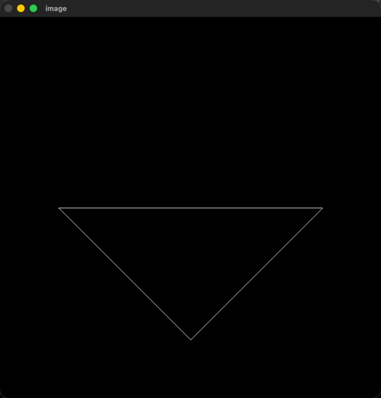
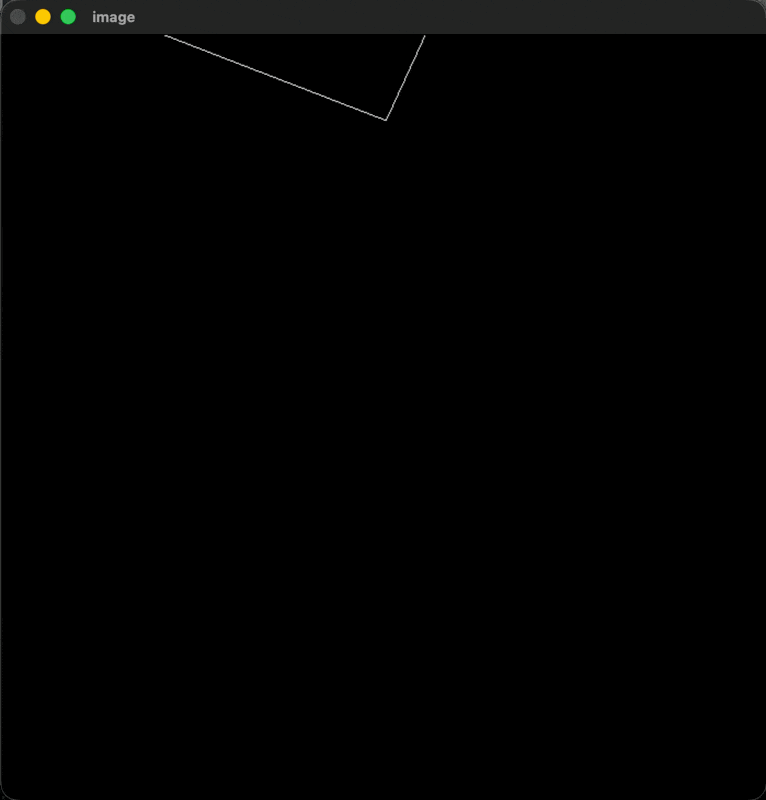

# 说明

- 涉及到的理论知识：
    - 模型变换中的（3D）旋转变换：绕 z 轴旋转，以及绕任意过原点的轴旋转（罗德里格斯旋转公式，Bonus 部分）
    - 投影变换：
        - 透视投影
        - 正射投影

- 其实可以再补充一段用命令行指定任意轴的代码，但因时间问题就不写了（~~其实是懒了~~）
- 运行结果
    - 绕 z 轴旋转
    
        

            
        

    
    - 绕任意轴旋转（选取方向 (1, 1, 1)）

        

            
        
