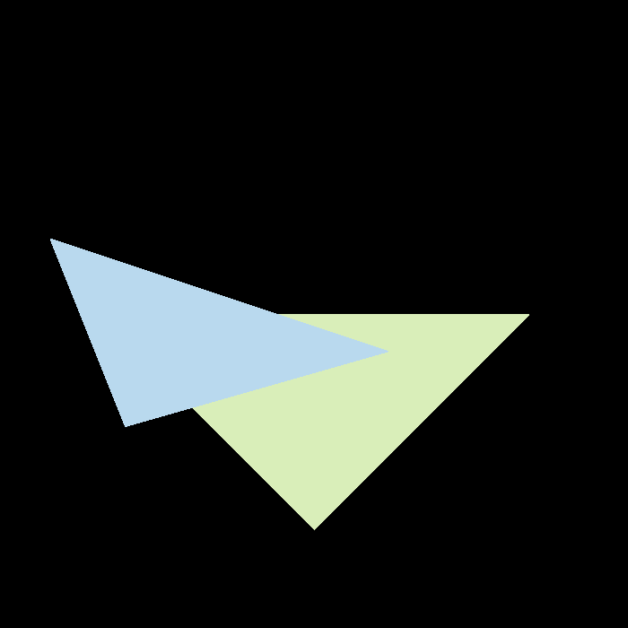
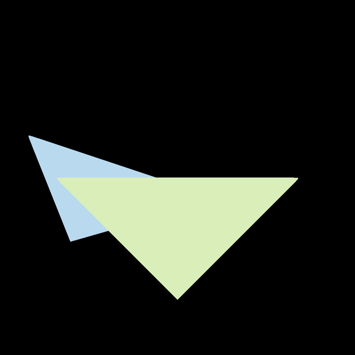

# 说明

- 理论知识：
    - 光栅化（是否在包围盒内 -> 是否在三角形内 -> 利用重心坐标计算深度值（这是下次作业的内容）），并利用深度缓冲区（z-buffer）确定正确的渲染顺序
    - 通过 MSAA 实现反走样（Bonus 部分）

- 代码实现：
    - `insideTriangle()`：测试点是否在三角形内
        - 将函数签名中的 `x`, `y` 类型改为 `float`，否则 MSAA 不会生效
        - 利用课上介绍的方法：沿顺/逆时针，计算三角形某个顶点到该点的连线和到下一个顶点的连线的叉积，如果三个叉积的符号（方向）一致，说明点在三角形内
    - `rasterize_triangle()`：执行三角形光栅化算法
        - z-buffer 部分比较简单，并且代码框架已给出关键的计算步骤，故省略
        - 对于提高题要求的超采样（即 MSAA）处理，我的解决方案是：
            - 新增成员变量 `sample_buf` 和 `sample_color_buf`，对应原来的 `depth_buf` 和 `frame_buf`，但大小为它们的四倍（因为每个像素点细分为 2*2 的采样空间）
            - 对位于三角形内的采样点按和 z-buffer 部分类似的方式处理；需要注意索引的计算，并且要用 `sample_buf` 和 `sample_color_buf`；不要调用 `set_pixel`，它是作用在 `frame_buf`，要在最后用
            - 将 4 个采样点的颜色加权平均值作为该像素点的颜色值设置，这个时候才要用 `set_pixel` 

- 注意：代码框架和老师上课讲的有些出入————代码框架是左手系的，我（包括很多人）都是按右手系做的（作业 1）。由于作业 1 的投影变换代码会复用到作业 2 上，所以最后得到的三角形是上下颠倒的。老师在 Lecture 08 开头说过这没关系（不过还是被我倒回来了）。
- 渲染结果：
    - 基础部分：
        
        

            
        

    
    - Bonus 部分（可以看到边缘锯齿感明显减弱了）：

        

            
        
