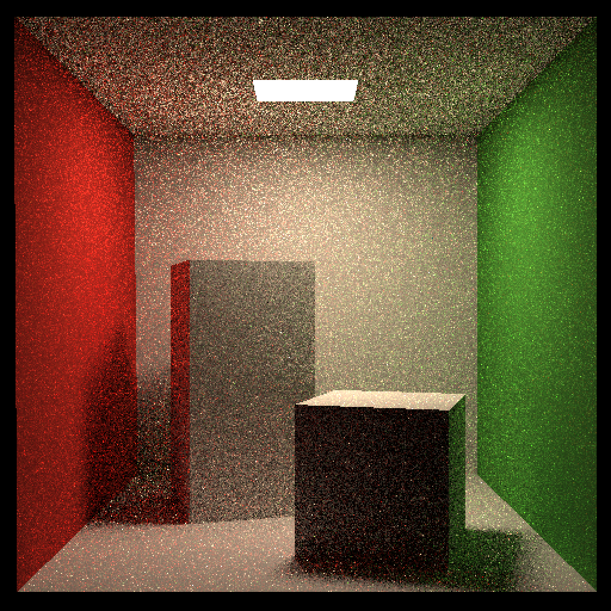
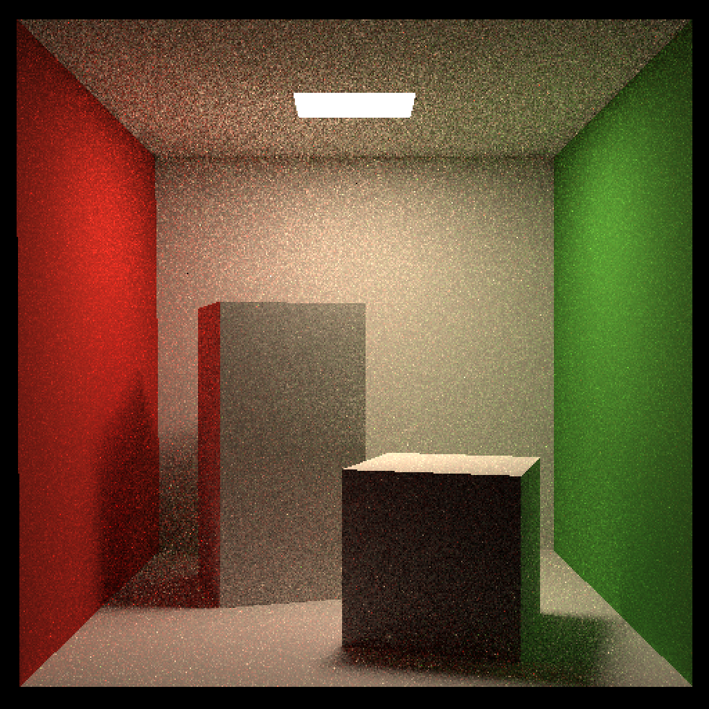
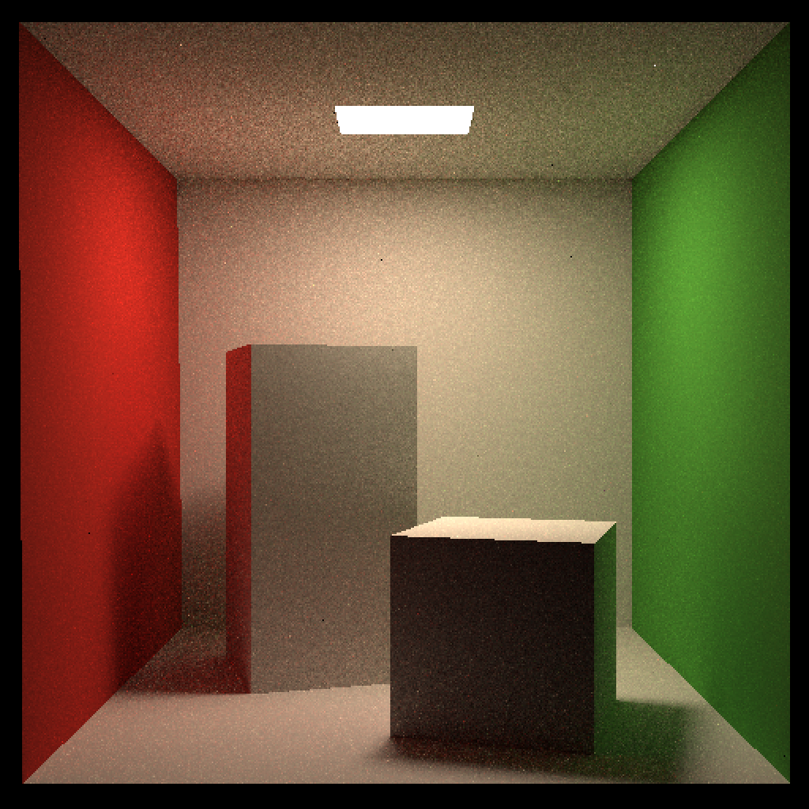
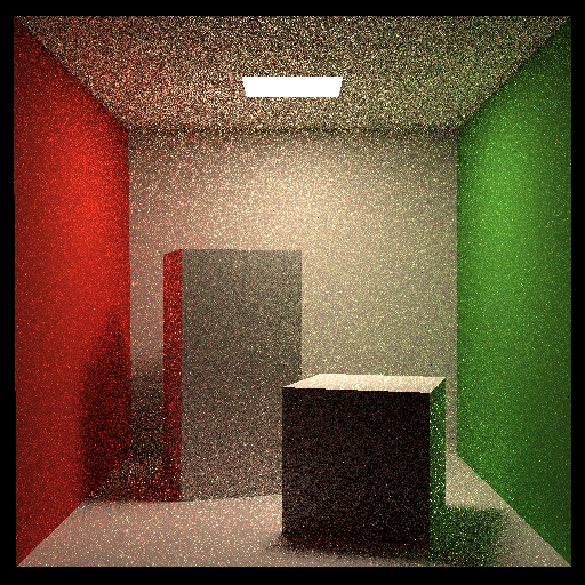
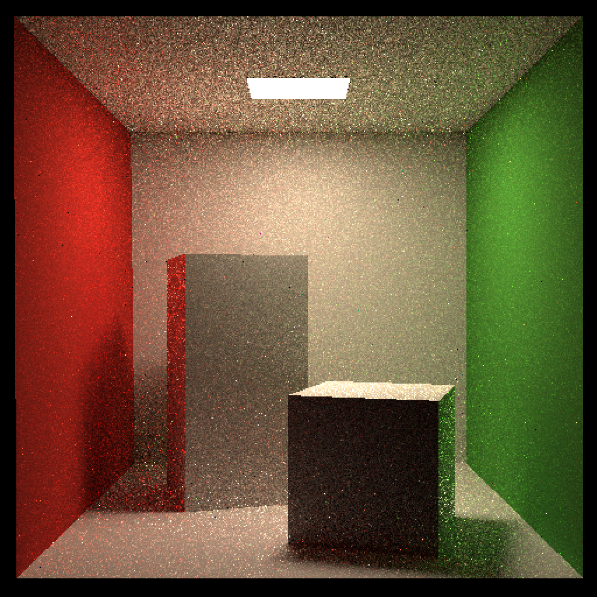

# 说明

所有评分点均完成。

- 提交格式正确
- 拷贝了前次作业中的 `Triangle::getIntersection`、`IntersectP` 和 `getIntersection`
- 修改 `castRay` 来实现路径追踪（实现实验说明中给出的第二段伪代码）
    - 伪代码中没提到的一些地方有：
        - 先检查光线是否与场景相交，若连场景都没相交，那后面就没必要判断了
        - 再看光线是否击中发光表面，若是则直接范围发光表面的颜色
        - 计算直接光照时，对于从相交点到采样点的那条射线，要将相交点稍微移开一点点，避免自相交问题
            - **自相交**：由于浮点数精度问题，计算得到的相交点位置会在表面下方一点的位置，如果还是从这个地方打出一条射线，那么就有可能和它真正的位置相交，这就是自相交现象，此时这个地方被认为是挡住的，所以会被渲染成黑色
        - 计算射线是否命中光源时也要容许一些误差（也是因为浮点数误差）
    - 其他地方基本上可以按部就班实现（需将伪代码和代码框架中实际有的字段和方法联系起来）
- 实现多线程（`Renderer.cpp` 中的 `Render` 方法）：利用 C++11 引入的 `thread` 库，创建多个线程，实现并行按行渲染像素。实测结果为（`sp=8`，在 Macbook Air（M4）上测试）：
    - 单线程：178s
    - 多线程（共 9 个线程）：40s
- 实现微表面（`Material.hpp` 中的 `eval` 方法，`sample` 和 `pdf` 可完全照搬）：
    - 先要创建对应的枚举量 `MICROFACET`
    - 除了课上提供的公式，我们还需要知道如何求分子上的那三个东西
        - 法线分布：采用 GGX/Trowbridge-Reitz 分布，即 $D(h) = \frac{\alpha^2}{\pi \cdot ((n \cdot h)^2 \cdot (\alpha^2 - 1) + 1)^2}$
        - 菲涅尔项：使用 Schlick 近似，即 $F = F_0 + (1 - F_0) \cdot (1 - \cos\theta)^5$
            - $F_0$ 是基础反射率，对于非金属一般取 `Vector3f(0.04)`
        - 几何遮蔽函数：使用 Smith's method
    
            $$
            \begin{aligned}
            G(i, o, h) & = G_1(i) \cdot G_1(o) \\
            G_1(v) & = \frac{n \cdot v}{(n \cdot v)(1-k) + k}, \quad k = \frac{\alpha^2}{2}
            \end{aligned}
            $$

    - 所以需引入粗糙度字段 `roughness`（即公式中的 $\alpha$），取值在 0.2 到 0.5 左右
    - 由于公式中分母部分可能会接近 0，所以需用 `std::max(epsilon, denominator)` 来保护
    - 注意 `wi` 的方向，要取负号
    - 最终结果还得加上漫反射项 `(1 - F) * Kd / π`
    - 由于设备限制，我只能测试到 `SPP=128` 的情况，但图像噪点还是有点多，所以很难看出微表面材质有什么不同...
- 渲染结果：
    - 漫反射
        - SPP=8
            
            

                
            

        
        - SPP=32
        
            

                
            

        
        - SPP=128
    
            

                
            

    - 微表面
        - SPP=8
            
            

                
            

        
        - SPP=32
        
            

                
            

        
        - SPP=128
    
            

                
            
